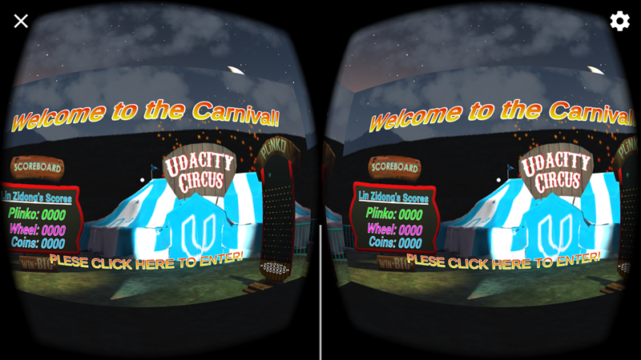
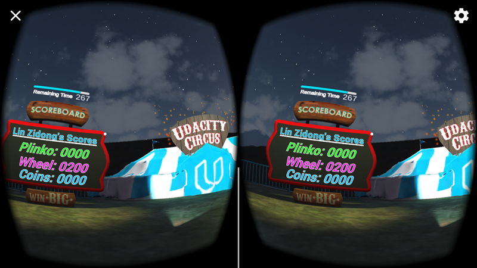
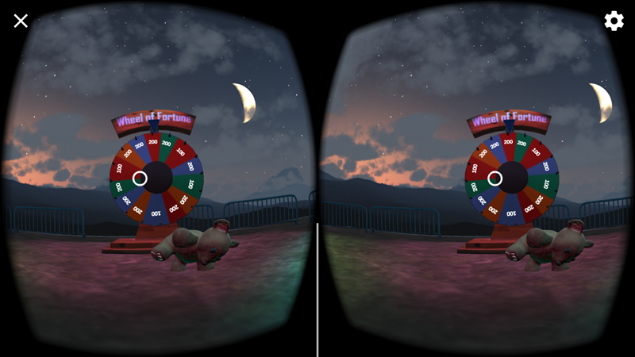

# CARNIAL IN VR

Modified from Udacity Project,  
and add some function.

--by Zidong Lin(梓栋 林)

*****************************

### Support
* Google VR SDK for Unity version: 1.50.0
* Submitting for Android

* EditorVersion: Unity 5.6.1f1

*****************************

### File Directory(Integrated Project(download)：https://pan.baidu.com/s/1nvLW5fF password：lrx1)
* Assets
* Build
 - Carnival1.0.apk
* ProjectSettings
* 3 Screenshot images
* README.md

*****************************
### V1.0.0 Features
1. Change Scoreboard text and adjust it
2. Change the Min and Max Toss Power of the Carnival Coin Toss
3. Change the point values displayed on the wedge of the Wheel of Fortune
4. Change the Oscillation Distance on the Carnival Plinko
5. Adjust the position of the Teddy Bear
6. Add a start scene("Login") before entering the carnival
7. Add some fireworks behind the tent
8. Add a timer upon Scoreboard, player can see the remaining time, and when the time is over,it will come back to the "Login" scene

